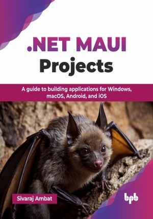

# .NET MAUI Projects

A guide to building applications for Windows, macOS, Android, and iOS.

This is the repository for [.NET MAUI Projects
](https://bpbonline.com/products/net-maui-projects?variant=44400471441608),published by BPB Publications.

## About the Book
.NET Multi-platform App UI (.NET MAUI) is a cross-platform framework for creating native mobile and desktop apps with C# and eXtensible Application Markup Language (XAML). Using .NET MAUI, you can develop apps running on Android, iOS, macOS, and Windows from a single shared codebase.

This book guides readers through the fundamentals of .NET MAUI cross-platform application development. It begins by exploring the concept of cross-platform development and introduces .NET MAUI, highlighting its evolution from Xamarin.Forms. The book then covers essential topics such as setting up the development environment, learning C# programming fundamentals, and mastering XAML for defining the user interface, including data binding. Through a series of practical projects, including a Color Picker, Tip Calculator, BMI Calculator, Unit Converter, and Weather App, readers gain hands-on experience in applying .NET MAUI concepts to build real-world mobile applications.

The readers will gain a solid foundation in developing cross-platform applications using .NET MAUI. They will gain enough knowledge and skills to build simple applications for Windows, macOS, Android, and iOS.  

## What You Will Learn
• Explore .NET MAUI, its evolution from Xamarin, supported platforms, and key features of this modern framework.

• Set up a development environment with Visual Studio IDE and emulators for hands-on app creation.

• Master C# programming essentials, the core language required for building applications in .NET MAUI.

• Create engaging user interfaces with XAML.

• Build five real-world apps, including a Color Picker, Tip Calculator, BMI Calculator, Unit Converter, and Weather App, using .NET MAUI.
